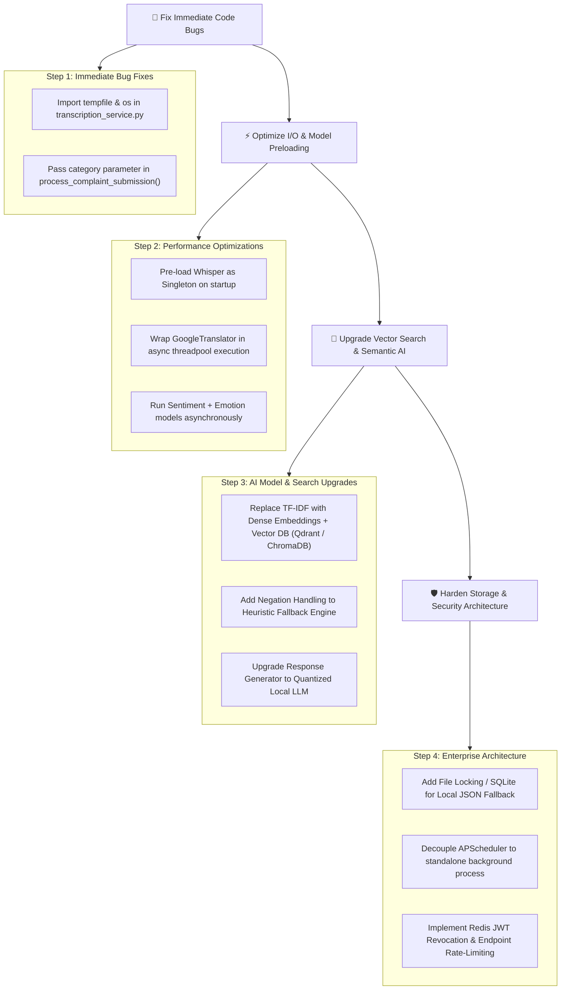

# 📊 SentriMail — Baseline Models, System Architecture & Project Flaws Analysis

## 📌 1. Project Overview & Architecture

### 1.1 What is SentriMail?
**SentriMail** is an enterprise-grade AI complaint management and triage platform built using **FastAPI**, **Python 3.10+**, **Hugging Face Transformers**, **OpenAI Whisper**, and **MongoDB** (with a zero-downtime local JSON fallback engine). 

The platform automates:
- **Multilingual Ingestion**: Text and voice complaint submission with auto-language detection and translation to English.
- **Multi-Task AI Analysis**: Sentiment analysis, emotion classification, emergency keyword detection, and root-cause summary generation.
- **Dynamic Mathematical Priority Scoring**: Calculates dynamic urgency scores ($0 - 100$) and assigns SLA severity tiers (`LOW`, `MEDIUM`, `HIGH`, `CRITICAL`).
- **Automated Resolution Workflow**: Auto-resolves safe, low-urgency complaints using TF-IDF dataset vector matching or Flan-T5 text generation.
- **SLA Time-Decay Escalation**: Background background job (`APScheduler`) escalates stale tickets across severity tiers.
- **Enterprise RBAC**: Role-based routing (Customer `/user/` vs. Admin `/admin/`) with HTTP-only cookie JWT security.

---

## 🔬 2. Baseline Machine Learning & NLP Models Specifications

SentriMail uses a **hybrid AI design strategy**: primary inference runs on lightweight local Hugging Face Transformer models and Whisper, backed by rule-based heuristic engines for instant fallback during high load or resource constraints.

| Component / Task | Primary Model | Architecture / Parameters | Fallback Engine | Primary Role |
| :--- | :--- | :--- | :--- | :--- |
| **Sentiment Analysis** | `distilbert-base-uncased-finetuned-sst-2-english` | Transformer (66M params) | Keyword-density heuristic (`NEGATIVE_KEYWORDS` & `POSITIVE_KEYWORDS`) | Binary sentiment tagging (`POSITIVE` / `NEGATIVE` / `NEUTRAL`) + confidence score ($0.0 - 1.0$) |
| **Emotion Classification** | `j-hartmann/emotion-english-distilroberta-base` | RoBERTa (82M params) | Pattern dictionary (`EMOTION_PATTERNS`) | 7-class emotion scoring (`Anger`, `Fear`, `Sadness`, `Disgust`, `Surprise`, `Joy`, `Neutral`) |
| **Auto-Response Generation** | `google/flan-t5-small` | Seq2Seq LLM (60M params) | Hardcoded parametric support templates | Synthesizes custom response copy for safe `LOW` priority tickets |
| **Speech-to-Text** | `OpenAI Whisper` (`base`) | Encoder-Decoder (74M params) | None (Returns empty string on failure) | Converts uploaded WAV/MP3 voice recordings into English/native text |
| **Response Retrieval** | Custom TF-IDF Cosine Similarity | Custom Vector Model (`data/response_model.json`) | Rule-based template generator | Matches incoming complaints against pre-curated resolution datasets |
| **Language Translation** | `deep-translator` (`GoogleTranslator`) | External Google Translate API Wrapper | None (Falls back to raw input text) | Bi-directional translation (detect native language $\rightarrow$ English for AI $\rightarrow$ native resolution) |

---

## ⚔️ 3. Comparative Matrix: Baseline Models vs. Proposed Upgrades

| AI Task | Current Baseline Model | Strengths | Benchmark Metrics | Weaknesses & Flaws | Recommended Modern Replacement |
| :--- | :--- | :--- | :--- | :--- | :--- |
| **Sentiment Analysis** | `DistilBERT` SST-2 | Lightweight, fast CPU inference (~40ms), 97% BERT accuracy | Latency: ~40ms<br>RAM: ~260MB | Binary focus (misses nuanced neutral context), max 512 tokens truncation | `cardiffnlp/twitter-roberta-base-sentiment-latest` or `BGE-Micro` embeddings |
| **Emotion Recognition** | `DistilRoBERTa` (7-class) | Specialized customer service emotion detection | Latency: ~60ms<br>RAM: ~330MB | Fixed 7 emotions; struggles with sarcasm or passive-aggressive tone | Fine-tuned `DeBERTa-v3-small` or zero-shot LLM classification |
| **Response Retrieval** | TF-IDF Cosine Similarity | Zero memory footprint, zero external API costs | Latency: <5ms<br>RAM: <10MB | Exact token matching only; fails on semantic synonyms ("can't login" vs "auth failed") | **Vector DB** (Qdrant / ChromaDB) with `all-MiniLM-L6-v2` dense embeddings |
| **Speech-to-Text** | OpenAI Whisper `base` | Robust multilingual speech recognition | Latency: ~1.2s<br>RAM: ~290MB | Model loaded **on every request** causing heavy RAM/latency spikes | **Faster-Whisper** CTranslate2 execution + **Singleton Pre-loading** |
| **Response Generation** | `Flan-T5-small` | In-process local execution, basic instruction following | Latency: ~180ms<br>RAM: ~240MB | Hallucination risk on complex inputs, small context window | Quantized `Llama-3.2-1B-Instruct` or `Mistral-7B` via Ollama / vLLM |
| **Language Translation** | `GoogleTranslator` | Free translation for 100+ languages | Latency: ~300ms<br>RAM: Minimal | **Synchronous network blocking call**, rate-limited by free API endpoints | Asynchronous `NLLB-200` local model or async `htpx` translation worker |

---

## ⚠️ 4. Exhaustive Technical & Architectural Flaws in SentriMail

An in-depth code audit of the current codebase reveals several critical bugs, performance bottlenecks, and architectural limitations:

### 🔴 4.1 Critical Code Bugs
1. **Missing Imports in `transcription_service.py`**:
   - **Location**: `app/services/transcription_service.py` (Lines 14, 26)
   - **Issue**: `tempfile` and `os` are referenced inside `transcribe_audio_file()` but are **never imported** at the top of the file.
   - **Impact**: Any audio submission attempt will crash with a runtime `NameError: name 'tempfile' is not defined`.

2. **Category Hardcoding Bug in `complaint_service.py`**:
   - **Location**: `app/services/complaint_service.py` (Lines 120, 133)
   - **Issue**: In `process_complaint_submission()`, the category parameter is hardcoded to `"other"`:
     ```python
     analysis = analyze_complaint(translated_text, category="other", username=username)
     ```
   - **Impact**: User-selected categories (`billing`, `technical`, `delivery`, etc.) are completely ignored during complaint creation.

---

### 🟠 4.2 Performance & Resource Bottlenecks
3. **On-Demand Whisper Model Loading (Memory Leak & High Latency)**:
   - **Location**: `app/services/transcription_service.py` (Line 19)
   - **Issue**: `whisper.load_model("base")` is invoked **inside the request handler** for every single voice upload instead of being pre-loaded on application startup.
   - **Impact**: Adds 1–3 seconds of latency per audio upload and creates CPU/RAM spikes under concurrent user uploads.

4. **Synchronous I/O Blocking in Event Loop**:
   - **Location**: `app/services/complaint_service.py` (Lines 116, 149)
   - **Issue**: `GoogleTranslator(...).translate(...)` performs blocking HTTP network requests directly within async request workflows.
   - **Impact**: Blocks the FastAPI single-threaded event loop, severely throttling server throughput under high load.

5. **Sequential Transformer Pipeline Executions**:
   - **Location**: `app/services/ai_service.py` (Lines 452–468)
   - **Issue**: `_sentiment_pipeline` and `_emotion_pipeline` run sequentially on CPU for every single complaint request.
   - **Impact**: High CPU utilization and doubled latency (~180ms - 300ms per request).

---

### 🟡 4.3 Model & Algorithmic Flaws
6. **Semantic Failure of TF-IDF Vector Search**:
   - **Location**: `app/services/ai_service.py` (Lines 83–98, 155–165)
   - **Issue**: TF-IDF relies strictly on token overlap. Complaints expressing the same problem with different words (e.g., *"Cannot connect to server"* vs *"Database cluster unreachable"*) fail to match dataset responses.

7. **Overly Permissive Similarity Threshold (`0.12`)**:
   - **Location**: `app/services/ai_service.py` (Line 165)
   - **Issue**: `best_score < 0.12` threshold is extremely low. Weak or unrelated dataset responses can accidentally match incoming complaints and send irrelevant responses to customers.

8. **Naïve Rule-Based Heuristics (Negation Blindness)**:
   - **Location**: `app/services/ai_service.py` (Lines 237–261, 270–288)
   - **Issue**: Keyword scanning in rule-based fallback mode does not handle negations (e.g., *"Not urgent"*, *"No error occurred"* still trigger negative keywords and urgency priority boosts).

9. **Generative LLM Exception Swallowing**:
   - **Location**: `app/services/ai_service.py` (Lines 360–365)
   - **Issue**: Empty `except:` block around `_generative_pipeline` silently swallows model failures or GPU out-of-memory errors without logging.

---

### 🔵 4.4 Persistence & Architectural Limitations
10. **Race Conditions in Local JSON Fallback Storage**:
    - **Location**: `app/core/database.py` (Lines 60–67, 83–86, 110–113)
    - **Issue**: `_LocalCollection` reads and writes `complaints.json` / `users.json` directly without file locking (`fcntl` / `msvcrt`) or atomic write operations.
    - **Impact**: High risk of data loss or file corruption under concurrent write requests when MongoDB is down.

11. **In-Process Single-Node Background Scheduler**:
    - **Location**: `app/main.py` (Lines 51–52)
    - **Issue**: `BackgroundScheduler` runs in-process inside Uvicorn. Deploying with multiple worker processes (`uvicorn --workers 4`) causes duplicate SLA escalation background tasks to run concurrently across workers.

---

### 🔒 4.5 Security & Vulnerabilities
12. **Insecure Dev Fallback Secret Key**:
    - **Location**: `app/core/security.py` (Lines 16–21)
    - **Issue**: If `JWT_SECRET_KEY` is missing in `.env`, the system defaults to a hardcoded string (`"sentrimail-dev-fallback-secret-key-32bytes"`), making JWT signatures vulnerable if deployed unconfigured.

13. **Absence of Token Blacklisting & Rate Limiting**:
    - **Issue**: Logging out does not invalidate the JWT cookie server-side (stateless token). Furthermore, public endpoints (`/api/analyze`, `/api/transcribe`, `/user/submit`) lack rate-limiting middleware, exposing the server to resource exhaustion attacks.

---

## 🚀 5. Recommended Remediation & Upgrade Roadmap



---
*Document Status: Completed system analysis & architectural review.*
