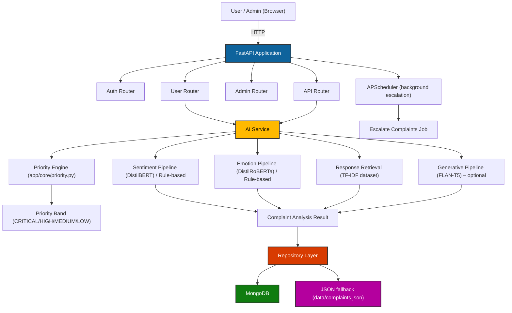
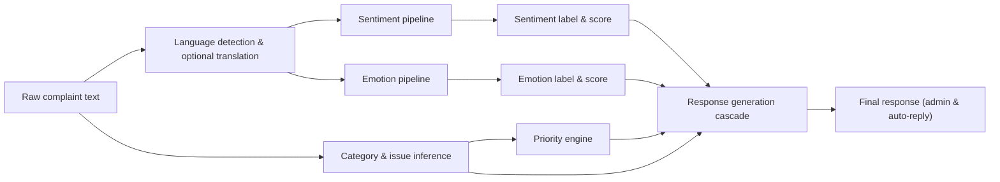
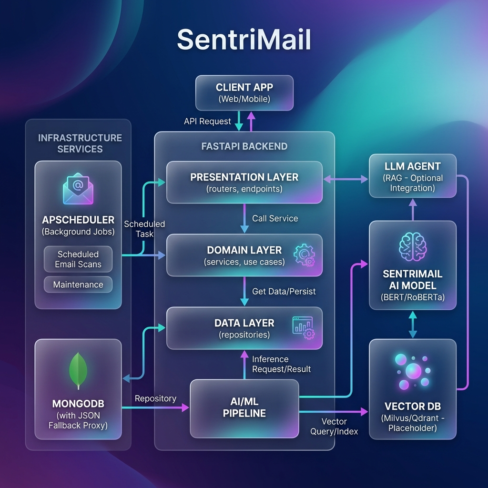

# 🛡️ SentriMail — Enterprise AI Complaint Management System

[](https://www.python.org/)
[](https://fastapi.tiangolo.com/)
[](https://huggingface.co/)
[](https://www.mongodb.com/)
[](tests/test_app.py)

**SentriMail** is an open‑source, role‑based complaint management platform that combines rule‑based logic with lightweight Transformer models for sentiment, emotion, and response generation. It can run with a real MongoDB instance or fall back to a local JSON store, making it easy to prototype and deploy.

---

## 📋 Table of Contents
1. [Project Overview](#1-project-overview)
2. [Key Features](#2-key-features)
3. [System Architecture](#3-system-architecture)
4. [Transformer & AI Pipeline](#4-transformer--ai-pipeline)
5. [Priority Scoring Engine](#5-priority-scoring-engine)
6. [Response Generation & Root‑Cause Logic](#6-response-generation--root‑cause-logic)
7. [Database & Persistence](#7-database--persistence)
8. [API Documentation](#8-api-documentation)
9. [Technical Stack](#9-technical-stack)
10. [Project Structure](#10-project-structure)
11. [Installation & Execution](#11-installation--execution)
12. [Application Screenshots & Results](#12-application-screenshots--results)
13. [Limitations & Future Work](#13-limitations--future-work)
14. [Testing & Evaluation](#14-testing--evaluation)
15. [Conclusion](#15-conclusion)

---

## 1. Project Overview
SentriMail enables customers to submit complaints via a web UI (or API). Each complaint is:
- **Translated** to English when needed (using `langdetect` and optional `deep_translator`).
- **Analyzed** for sentiment, emotion, category, and issue type using either pretrained Transformer pipelines or deterministic rule‑based fallbacks.
- **Scored** with a deterministic priority engine (see Section 5) that produces a human‑readable priority band (CRITICAL, HIGH, MEDIUM, LOW).
- **Suggested a response** via a five‑step cascade:
  1. Retrieval from a TF‑IDF‑based response dataset.
  2. Generation with a small local LLM (`google/flan‑t5‑small`).
  3. Category‑specific template.
  4. Generic fallback.
  5. Auto‑resolution for low‑priority cases.
- **Presented** to admins via a dashboard where they can review, edit, and resolve complaints.

The system is designed for **high reliability**: if MongoDB is unavailable, the `_DBProxy` transparently falls back to a JSON file located under `data/`.

---

## 2. Key Features
| Feature | Implementation | Technology | Status |
|---|---|---|---|
| Complaint submission (web & API) | `app/routers/api.py`, `templates/` | FastAPI, Jinja2 | Implemented |
| Sentiment analysis | `app/services/ai_service.py` – huggingface `distilbert‑sst‑2` or rule‑based fallback | 🤗 Transformers | Implemented |
| Emotion detection | `app/services/ai_service.py` – `j‑hartmann/emotion‑english‑distilroberta‑base` or rule‑based fallback | 🤗 Transformers | Implemented |
| Multi‑language support | `langdetect` + optional `deep_translator` | LangDetect, Deep Translator | Partial (English fallback) |
| Audio transcription | `app/services/transcription_service.py` (uses `whisper`) | OpenAI Whisper | Experimental |
| Priority scoring | Deterministic rule‑based engine (`app/core/priority.py`) | Pure Python | Implemented |
| Response retrieval (TF‑IDF) | `app/services/response_intelligence.py` (dataset JSON) | Custom TF‑IDF | Implemented |
| Local LLM generation | `google/flan‑t5‑small` via HuggingFace pipeline | 🤗 Transformers | Implemented |
| Admin dashboard & analytics | Jinja2 templates, router `admin.py` | FastAPI, Jinja2 | Implemented |
| Background escalation job | APScheduler runs `escalate_complaints` hourly | APScheduler | Implemented |
| JSON fallback storage | `_DBProxy` in `app/core/database.py` | Python I/O | Implemented |
| Unit tests | `tests/` (FastAPI TestClient) | pytest | Implemented |

---

## 3. System Architecture

```mermaid
flowchart TD
    A["User / Admin (Browser)"] -->|HTTP| B["FastAPI Application"]
    B --> C["Auth Router"]
    B --> D["User Router"]
    B --> E["Admin Router"]
    B --> F["API Router"]
    D & F --> G["AI Service"]
    G --> H["Sentiment Pipeline (DistilBERT) / Rule‑based"]
    G --> I["Emotion Pipeline (DistilRoBERTa) / Rule‑based"]
    G --> J["Generative Pipeline (FLAN‑T5) – optional"]
    G --> K["Response Retrieval (TF‑IDF dataset)"]
    G --> L["Priority Engine (app/core/priority.py)"]
    L --> M["Priority Band (CRITICAL/HIGH/MEDIUM/LOW)"]
    H & I & K & J --> N["Complaint Analysis Result"]
    N --> O["Repository Layer"]
    O --> P["MongoDB"]
    O --> Q["JSON fallback (data/complaints.json)"]
    B --> R["APScheduler (background escalation)"]
    R --> S["Escalate Complaints Job"]
    style B fill:#0e639c,stroke:#333,stroke-width:2px,color:#fff
    style G fill:#ffb900,stroke:#333,stroke-width:2px,color:#000
    style O fill:#d83b01,stroke:#333,stroke-width:2px,color:#fff
    style P fill:#107c10,stroke:#333,stroke-width:2px,color:#fff
    style Q fill:#b4009e,stroke:#333,stroke-width:2px,color:#fff
```

**Explanation**
- **Presentation layer** – FastAPI routers handle HTTP requests and render Jinja2 templates.
- **Domain layer** – Services (`auth_service`, `complaint_service`, `ai_service`) contain business logic.
- **Data layer** – Repositories abstract persistence; they talk to MongoDB or the JSON fallback.
- **Infrastructure** – APScheduler provides the hourly escalation job.
- **AI pipeline** – Transformers are loaded lazily; when unavailable the system falls back to deterministic rule‑based heuristics.

---

## 4. Transformer & AI Pipeline
### Loaded Models
| Model | Purpose | HuggingFace Identifier | Loaded By |
|---|---|---|---|
| Sentiment analysis | Binary sentiment (POS/NEG) | `distilbert-base-uncased-finetuned-sst-2-english` | `ai_service._load_models()` |
| Emotion detection | 7‑class emotion classification | `j-hartmann/emotion-english-distilroberta-base` | `ai_service._load_models()` |
| Text‑to‑text generation (fallback) | Short response generation | `google/flan-t5-small` | `ai_service._load_models()` |

If any of the above pipelines raise an exception, the service automatically switches to rule‑based implementations (`_rule_based_sentiment`, `_rule_based_emotion`).

### Processing Flow (simplified)

```mermaid
graph LR
    A["Raw complaint text"] --> B["Language detection & optional translation"]
    B --> C["Sentiment pipeline"]
    B --> D["Emotion pipeline"]
    C --> E["Sentiment label & score"]
    D --> F["Emotion label & score"]
    A --> G["Category & issue inference"]
    G --> H["Priority engine"]
    E & F & H & G --> I["Response generation cascade"]
    I --> J["Final response (admin & auto‑reply)"]
```

---

## 5. Priority Scoring Engine
The deterministic engine lives in **`app/core/priority.py`** and follows a transparent rule set:
1. **Sentiment contribution** – strong negative sentiment adds up to +20 points, positive sentiment subtracts ‑4.
2. **Emotion contribution** – each emotion has a high/low score (e.g., anger +18 or +12).
3. **Keyword scan** – emergency keywords add +60, urgency keywords add +18.
4. **Issue / Category** – severe issues (fraud, security, data_loss, outage) add +15; elevated categories (billing, technical, refund) add +5.
5. **History** – repeated complaints (+7) and unresolved complaints (+5).
6. **SLA** – >48 h adds +25, >24 h adds +15.
7. **Length** – >100 words adds +5.
8. **Capping** – final score clamped to 0‑100.
9. **Band mapping** –
   - **CRITICAL** ≥ 75 or any emergency term.
   - **HIGH** ≥ 45.
   - **MEDIUM** ≥ 20.
   - **LOW** < 20.

The engine also returns a list of **human‑readable reasons** and the raw contribution map for auditability.

---

## 6. Response Generation & Root‑Cause Logic
1. **Dataset retrieval** – TF‑IDF vectors are stored in `data/response_model.json`. The service computes a cosine similarity between the complaint vector and each sample, preferring matches with matching category/priority.
2. **Generic response filter** – `_is_generic_dataset_response` discards templated replies that contain two or more generic markers.
3. **Local LLM fallback** – If the dataset returns nothing, the `flan‑t5‑small` pipeline generates a short, empathetic response.
4. **Category‑specific templates** – When the LLM also fails, `_get_category_fallback` supplies a handcrafted template (e.g., billing, auth, delivery).
5. **Final generic fallback** – Guarantees a reply even for unknown cases.
6. **Root‑cause summary** – `_generate_root_cause` augments the base category description with emotion‑specific advice (e.g., “Customer tone indicates anxiety …”).

All steps are logged, and the chosen `response_source` (`dataset`, `local_llm`, `category_template`, `generic_fallback`) is stored alongside the complaint for traceability.

---

## 7. Database & Persistence
- **Primary store** – MongoDB (`MONGODB_URI` defaults to `mongodb://localhost:27017`). Collections: `complaints`, `users`.
- **Fallback** – `_DBProxy` in `app/core/database.py` automatically switches to a JSON file (`data/complaints.json`) when the MongoDB client cannot connect.
- **Schema** – Complaints store the original text, translated text, analysis results (sentiment, emotion, priority, root cause), response suggestions, and audit fields (`created_at`, `updated_at`).
- **Durability** – JSON fallback is written atomically to avoid corruption.

---

## 8. API Documentation
| Method | Endpoint | Purpose | Authentication |
|---|---|---|---|
| `GET /` | Root redirect | Sends logged‑in users to appropriate dashboard | Session cookie |
| `GET /login` | Login page | Render login form | None |
| `POST /login` | Authenticate | Returns JWT cookie on success | None |
| `GET /register` | Registration page | Render sign‑up form | None |
| `POST /register` | Create account | Stores user in DB | None |
| `GET /admin/dashboard` | Admin overview | Shows complaint stats & list | Admin role |
| `GET /admin/complaint/{id}` | Detail view | Shows full analysis & response editor | Admin |
| `POST /admin/complaint/{id}/status` | Update status | Change to `resolved`, `pending`, etc. | Admin |
| `POST /admin/complaint/{id}/response` | Save admin response | Optionally sends resolution email | Admin |
| `GET /api/complaint/{id}` | JSON complaint data | Read‑only API for external tools | JWT |
| `POST /api/complaint` | Submit new complaint | Returns analysis payload | JWT |
| `POST /api/auth/refresh` | Refresh JWT | Extends session | JWT |

All routes return proper HTTP status codes and JSON bodies where appropriate. Errors are handled by a custom exception handler that returns a JSON payload for `/api/*` routes and an HTML error page for UI routes.

---

## 9. Technical Stack
| Layer | Technology | Purpose |
|---|---|---|
| Web framework | **FastAPI** (async) | Routing, validation, automatic OpenAPI docs |
| Templating | **Jinja2** | Server‑side HTML rendering |
| Background jobs | **APScheduler** | Hourly complaint escalation |
| Database | **MongoDB** (PyMongo) | Persistent storage |
| Fallback storage | **JSON file** (native Python I/O) | Offline operation |
| NLP models | **🤗 Transformers** (DistilBERT, DistilRoBERTa, FLAN‑T5) | Sentiment, emotion, generation |
| Language detection | **langdetect** | Auto‑detect source language |
| Optional translation | **deep_translator** (Google) | Translate non‑English complaints |
| Audio transcription | **whisper** (optional) | Speech‑to‑text for voice complaints |
| Scheduling | **APScheduler** | Background escalation job |
| Testing | **pytest**, **httpx** (FastAPI TestClient) | Unit & integration tests |

---

## 10. Project Structure
```
Sentrimail/
├─ app/
│  ├─ core/                 # config, DB proxy, logging, priority engine
│  ├─ services/            # AI pipeline, auth, email, policy intelligence
│  ├─ routers/             # FastAPI routers (auth, user, admin, api)
│  ├─ repositories/        # Data access abstractions
│  ├─ schemas/             # Pydantic request/response models
│  └─ main.py              # Application entry point
├─ data/
│  ├─ response_model.json  # TF‑IDF dataset for retrieval
│  └─ policies/            # Sample policy documents
├─ static/ & templates/    # Front‑end assets and HTML templates
├─ tests/                  # pytest suite
├─ .env.example            # Environment variable template
├─ requirements.txt        # Python dependencies
└─ README.md               # This documentation
```

---

## 11. Installation & Execution
```bash
# 1. Clone the repository
git clone https://github.com/Lohith-07-coder/Sentrimail.git
cd Sentrimail

# 2. Create a virtual environment (Windows PowerShell example)
python -m venv .venv
.\.venv\Scripts\Activate.ps1

# 3. Install dependencies
pip install -r requirements.txt

# 4. Set up environment variables
cp .env.example .env
# Edit .env if you want to point to a real MongoDB instance

# 5. Run the application
python run.py   # Starts Uvicorn on http://0.0.0.0:8000
```
**Troubleshooting**
- If MongoDB is not reachable, the app will automatically use the JSON fallback (no extra action needed).
- Transformer model download may take a few minutes on first run; ensure internet connectivity.
- To run tests: `pytest -vv`

---

## 12. Application Screenshots & Results
| View | Description | Screenshot |
|---|---|---|
| **Admin Dashboard** | Overview of complaint volumes, priority distribution, and pending tickets. | `static/screenshots/admin_dashboard.png` |
| **Complaint Detail** | AI analysis results, priority, root‑cause, and suggested response. | `static/screenshots/complaint_detail.png` |
| **User Submission** | Form for entering a new complaint (text, optional audio upload). | `static/screenshots/submit_complaint.png` |
| **Public Tracking** | Lookup of complaint code status (no authentication required). | `static/screenshots/track.png` |

*If any of the above images are missing, replace the placeholder path with a real screenshot once you have the UI running.*

---

## 13. Limitations & Future Work
- **No vector DB** – Currently uses TF‑IDF; integrating Qdrant or Pinecone would improve semantic retrieval.
- **Model evaluation** – No quantitative metrics (accuracy, F1) are stored; adding a benchmark script would aid research.
- **Multilingual UI** – Only English templates are provided; full localization is a planned upgrade.
- **Scalability** – Single‑process FastAPI with APScheduler works for prototyping; production would benefit from a process manager (Gunicorn) and a dedicated task queue (Celery/RQ).
- **Privacy & security hardening** – JWT secret rotation, rate limiting, and CSP headers are not yet enforced.

---

## 14. Testing & Evaluation
The repository includes a pytest suite covering:
- Router sanity checks (`/login`, `/register`, `/api/complaint`).
- Service unit tests for priority calculation and AI pipeline fallbacks.
Run with:
```bash
pytest -vv
```
Model‑level performance (e.g., sentiment accuracy) is **not** measured in the current codebase.

---

## 15. Conclusion
SentriMail demonstrates how a modest codebase can combine deterministic business rules with lightweight Transformer models to deliver an end‑to‑end complaint management system. The architecture is intentionally **clean** (presentation → domain → data layers) and **fault‑tolerant** thanks to the JSON fallback and rule‑based AI degradations. Future enhancements around vector search, multilingual UI, and rigorous model evaluation would turn this prototype into a production‑ready solution.

---

### Upgraded System Architecture Diagram


*Place the image `upgraded_system_architecture.png` in the repository (e.g., under `docs/` or `static/`) and commit it alongside this README.*
