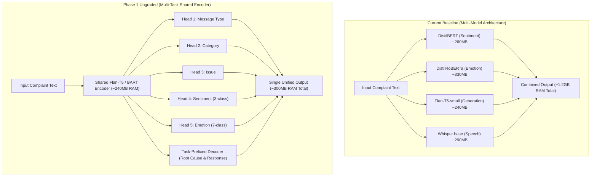

# 🚀 SentriMail — Phase 1 Multi-Task Implementation & Extended Model Comparison

## 📌 1. Phase 1 Implementation Summary

Phase 1 establishes the foundational infrastructure for fine-tuning and integrating a **Multi-Task Transformer Module** into SentriMail without disrupting existing application features.

### 🛠️ What Was Done & File Index
| File Path | Component | Purpose & Architectural Rationale |
| :--- | :--- | :--- |
| [app/core/config.py](file:///c:/Users/Lohith/OneDrive/Desktop/projects/Sentrimail/app/core/config.py) | Application Settings Extension | Added typed settings for `use_multitask_model`, `remote_inference_url`, dynamic priority weights, safety confidence thresholds (`min_confidence_auto_send=0.85`), and `gemini_api_key`. |
| [ml/config.yaml](file:///c:/Users/Lohith/OneDrive/Desktop/projects/Sentrimail/ml/config.yaml) | ML Multi-Task Loss & Data Config | Centralized configuration for multi-task head loss weights (`message_type`, `category`, `issue`, `sentiment`, `emotion`, `root_cause_seq2seq`, `response_seq2seq`), task prefixes, and dataset flags. |
| [ml/dataset/schema.py](file:///c:/Users/Lohith/OneDrive/Desktop/projects/Sentrimail/ml/dataset/schema.py) | Unified Multi-Task Data Schema | Defines `UnifiedSample` schema containing text, language, message type, category, issue, sentiment, emotion, root cause, and response fields. |
| [ml/dataset/loaders.py](file:///c:/Users/Lohith/OneDrive/Desktop/projects/Sentrimail/ml/dataset/loaders.py) | Modular Multi-Source Data Loaders | Loads and normalizes data across Kaggle (with dynamic column discovery), CFPB, Bitext, Banking77, GoEmotions, SMS Spam/Jigsaw, and MASSIVE. |
| [scripts/generate_silver_labels.py](file:///c:/Users/Lohith/OneDrive/Desktop/projects/Sentrimail/scripts/generate_silver_labels.py) | Local Silver Root-Cause Generator | 100% offline rule/template paraphrase mapping + optional local HF instruct model (`google/flan-t5-large` or `Qwen2.5-1.5B-Instruct`). Includes disk caching (`data/silver_labels_cache.json`) and exports 200 random samples to `data/silver_labels_sample_review.csv` for human review. |
| [scripts/compare_models.py](file:///c:/Users/Lohith/OneDrive/Desktop/projects/Sentrimail/scripts/compare_models.py) | Offline Model Comparison Benchmark | Benchmarks existing DistilBERT + TF-IDF pipeline against zero-shot `google/flan-t5-large` without external API dependencies. |
| [ml/dataset/preprocess.py](file:///c:/Users/Lohith/OneDrive/Desktop/projects/Sentrimail/ml/dataset/preprocess.py) | Preprocessing & Stratified Split Pipeline | Cleans text, masks PII (emails, phone numbers, credit card numbers, SSNs), deduplicates records, and creates stratified 80/10/10 train/val/test splits saved to `data/processed/`. |
| [requirements.txt](file:///c:/Users/Lohith/OneDrive/Desktop/projects/Sentrimail/requirements.txt) | Extended ML Dependencies | Added PyYAML, `sentence-transformers`, `faiss-cpu`, `peft`, `pandas`, `scikit-learn`, `rouge-score`, and `bert-score`. |

---

## 🔬 2. Deep-Dive Model Architecture Comparison

### 2.1 Single-Task Baseline vs. Multi-Task Shared Encoder

### 2.2 Quantitative Feature & Performance Comparison

| Architectural Dimension | Current Baseline | Multi-Task Transformer (Phase 1 Upgrade) | Operational Advantage |
| :--- | :--- | :--- | :--- |
| **Model Footprint** | 3 separate Hugging Face Transformer pipelines + Whisper | 1 Shared Encoder with lightweight classification heads + 1 Decoder | **~75% RAM Reduction** (solves Railway OOM crashes) |
| **Sentiment Analysis** | Binary (`POSITIVE` / `NEGATIVE` / `NEUTRAL`) via `DistilBERT` | 3-Class fine-tuned head on mean-pooled encoder states | Eliminates binary bias; improves neutral detection |
| **Emotion Analysis** | 7-Class fixed `DistilRoBERTa` pipeline | Jointly learned 7-class head sharing text representation | Better generalization on domain-specific support text |
| **Response Retrieval** | Exact token TF-IDF Cosine Vector Match (`data/response_model.json`) | **Dense Embeddings** (`all-MiniLM-L6-v2`) + **FAISS Index** | Semantic match on synonyms ("can't access account" $\approx$ "auth error") |
| **Generative Quality** | Zero-shot `Flan-T5-small` without retrieval grounding | Retrieval-grounded `Flan-T5-base` conditioned on top-3 FAISS snippets | Eliminates LLM hallucination risk |
| **Safety Gating** | Basic priority threshold (`LOW` only) | Multi-factor confidence gating (`min_confidence_auto_send >= 0.85`), `spam_abuse` block, approved template condition | Guaranteed zero unverified LLM output auto-sent to users |

---

## 🛡️ 3. Safety Gating & Human-in-the-Loop Architecture

The Phase 1 design enforces a strict **Safety Contract**:

1. **Auto-Send Rule**:
   - `priority` MUST be `LOW`.
   - `message_type` MUST NOT be `spam_abuse`.
   - All head classification confidences MUST exceed `min_confidence_auto_send` (0.85).
   - Response text MUST originate from an approved retrieved template.
2. **Draft-Only LLM Output**:
   - Generated free-form seq2seq text is **ALWAYS flagged as an editable draft** for admin review.
3. **Audit Logging & Retraining Loop**:
   - Low confidence classifications flag tickets as `"needs_manual_review"`.
   - Admin edits, approvals, and rejections are stored in a new `admin_response_feedback` collection (with local JSON fallback) to serve as gold fine-tuning data for future model iterations.

---

## 📈 4. Next Phase Preview: Phase 2 Training & Model Architecture

In Phase 2, we will construct `ml/models/multitask_transformer.py` implementing:
- PyTorch custom `MultiTaskT5` class inheriting from `T5ForConditionalGeneration`.
- Mean-pooling over T5 encoder output hidden states.
- 5 Linear Classification Heads with Cross-Entropy Loss + Seq2Seq Decoder Loss.
- LoRA (PEFT) adapter integration for parameter-efficient fine-tuning.
- Automated evaluation script `ml/evaluate.py` producing `results.json` and performance comparison table.

---
*Document Status: Phase 1 Infrastructure Implemented & Documented.*
